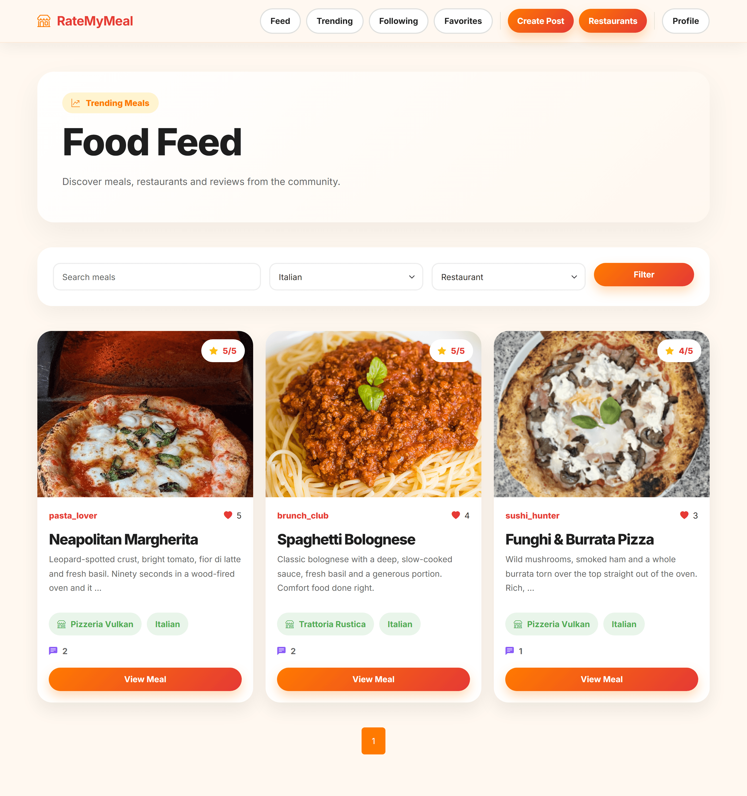
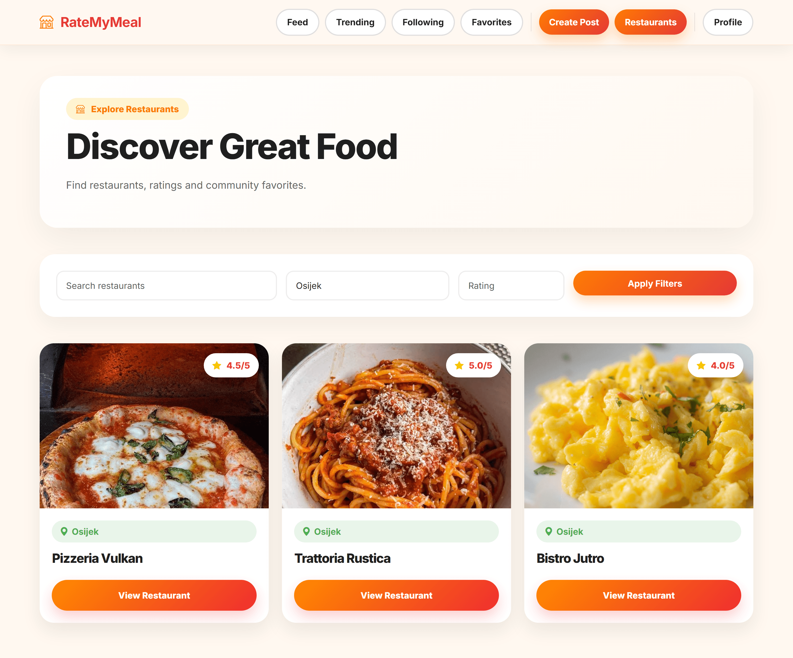
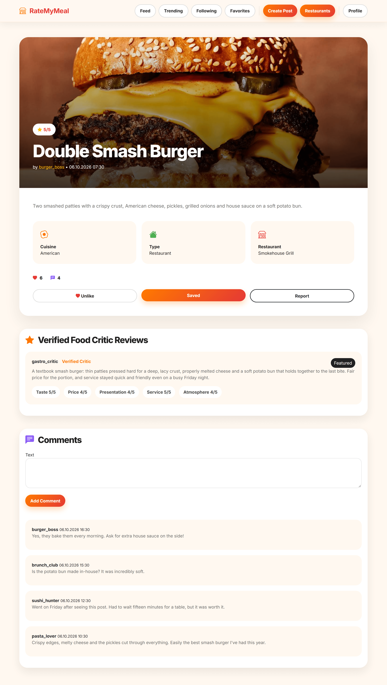
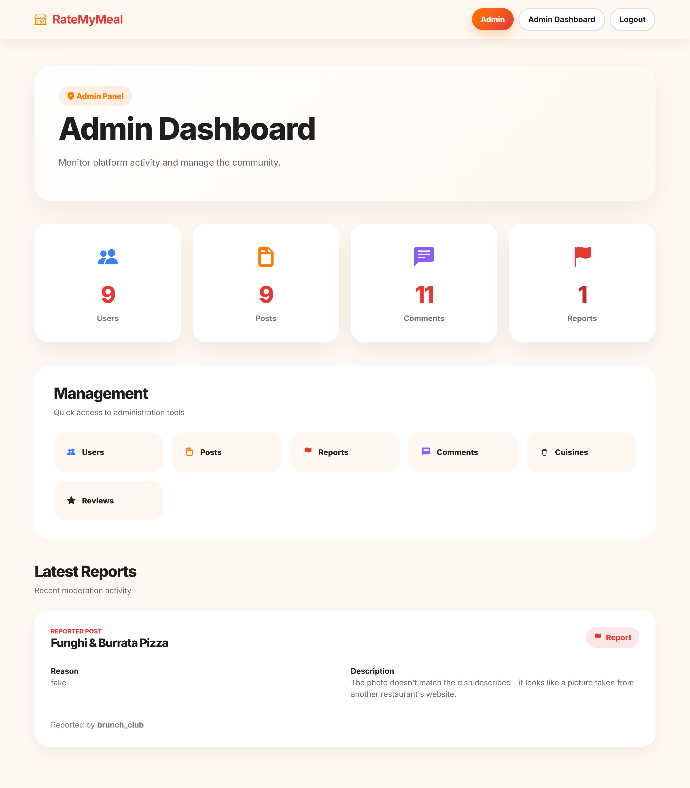

# RateMyMeal

## Table of Contents

1. [Project Overview](#project-overview)
2. [System Architecture](#system-architecture)
3. [User Roles](#user-roles)
4. [Permission Matrix](#permission-matrix)
5. [Installation Guide](#installation-guide)
6. [Configuration](#configuration)
7. [Running Locally](#running-locally)
8. [Demo Accounts](#demo-accounts)
9. [Security Features](#security-features)
10. [Authors](#authors)

---

## Project Overview

RateMyMeal is a Django web application for sharing and rating food experiences. The platform supports four user roles — regular users, food critics, restaurant owners, and administrators — each with a distinct set of capabilities and a role-aware interface. Users can publish food posts with photos and ratings, interact through likes, comments, and favorites, follow other users, and discover trending content. Restaurant owners manage their own venues. Food critics write structured multi-category reviews. Administrators monitor platform activity through a custom dashboard and the Django Admin panel.

| Item | Value |
|------|-------|
| Django apps | 5 (core, users, foodposts, restaurants, reviews) |
| Database models | Multiple relational models |
| User roles | 4 (Admin, User, Food Critic, Restaurant Owner) |

---

## Screenshots

<table>
  <tr>
    <td width="50%" valign="top">
      
      <p align="center"><sub>Food feed filtered by cuisine and post type</sub></p>
    </td>
    <td width="50%" valign="top">
      
      <p align="center"><sub>Restaurant directory filtered by city, with average ratings</sub></p>
    </td>
  </tr>
  <tr>
    <td width="50%" valign="top">
      
      <p align="center"><sub>Post detail with likes, a featured critic review and comments</sub></p>
    </td>
    <td width="50%" valign="top">
      
      <p align="center"><sub>Admin dashboard with platform metrics and the latest reports</sub></p>
    </td>
  </tr>
</table>

More screenshots (landing page, trending feed) are in [`docs/screenshots`](docs/screenshots).

---

## Key Features

**Content and Discovery**

- Paginated main feed filterable by cuisine type and post type (restaurant or home-made)
- Trending feed that ranks posts by a weighted engagement score: `(likes * 2) + (comments * 3) + rating`
- Following feed showing only posts from users the logged-in user follows
- Title-based search on the main feed
- Restaurant directory filterable by city name and minimum average rating

**Social Interactions**

- Toggle like and unlike on any post; enforced unique per user per post at the database level
- Create, edit, and delete comments on posts
- Bookmark posts as favorites; view personal favorites page
- Follow and unfollow other users via a many-to-many social graph

**Content Moderation**

- Report posts with a reason category (spam, offensive, fake, other) and an optional description; one report allowed per user per post
- Staff-only admin dashboard showing live counts of users, posts, comments, and reports, plus the five most recent reports
- Full Django Admin panel with search and filter configured for all registered models

**Role-Based Capabilities**

- Food Critics write CriticReview entries linked to food posts, with five separate 1-to-5 rating fields and a `is_featured` flag
- Food Critics access a personal dashboard listing all their reviews and a total count
- Restaurant Owners create and edit their own restaurant listings
- Restaurant Owners access an owner dashboard showing all their restaurants with computed average ratings
- Restaurant Owners view all food posts linked to their restaurants via an owner posts page

**User Profiles**

- Profile pages showing avatar, bio, location, post history, favorites, and follower or following counts
- Edit profile page for updating username, email, bio, location, and profile image
- UserProfile is automatically created on User post-save via a Django signal

---

## User Roles

Roles are stored in `UserProfile.role` as a CharField with choices `USER`, `CRITIC`, and `RESTAURANT_OWNER`. The Admin role is determined by Django's built-in `is_staff` and `is_superuser` flags; there is no separate role value for administrators.

### Regular User (USER)

The default role assigned to every registered account.

Can: browse the main feed, trending feed, and following feed; create, edit, and delete their own food posts; like, favorite, and comment on any post; edit and delete their own comments; report posts; view and edit their own profile; follow and unfollow other users; browse the restaurant directory and view restaurant detail pages.

Cannot: access the admin dashboard or Django Admin; write critic reviews; create or manage restaurant listings; edit or delete other users' posts or comments.

### Food Critic (CRITIC)

Assigned manually via Django Admin.

Can: everything a regular user can, plus write CriticReview entries on any food post (five rating categories plus review text and a featured flag); edit and delete their own critic reviews; access the critic dashboard at `/critic/dashboard/`.

Cannot: create or manage restaurants; access the admin dashboard.

### Restaurant Owner (RESTAURANT_OWNER)

Assigned manually via Django Admin.

Can: create new restaurant listings; edit their own restaurant listings; access the owner dashboard at `/restaurants/owner/dashboard/`; view all food posts linked to their restaurants at `/restaurants/owner/posts/`; create food posts.

Cannot: access the main feed, trending feed, following feed, favorites page, or restaurant list — visiting any of these redirects to the owner dashboard. Restaurant owners can only view or edit restaurants they own.

### Admin (is_staff = True)

Created via `createsuperuser` or the seed command.

Can: everything, plus access Django Admin at `/admin/`; access the custom admin dashboard at `/dashboard/admin/` showing platform-wide statistics and the five most recent reports; edit and delete any user's posts and comments. After login, admins are redirected to `/dashboard/admin/` instead of the feed.

---

## Permission Matrix

| Action | Anonymous | User | Critic | Owner | Admin |
|--------|:---------:|:----:|:------:|:-----:|:-----:|
| View landing page | Yes | Yes | Yes | Yes | Yes |
| Register or login | Yes | — | — | — | — |
| Browse main feed | No | Yes | Yes | No* | Yes |
| Browse trending feed | No | Yes | Yes | No* | Yes |
| Browse following feed | No | Yes | Yes | No* | Yes |
| View favorites page | No | Yes | Yes | No* | Yes |
| Browse restaurant list | No | Yes | Yes | No* | Yes |
| View restaurant detail | No | Yes | Yes | Own only | Yes |
| Create food post | No | Yes | Yes | Yes | Yes |
| Edit own food post | No | Yes | Yes | Yes | Yes |
| Edit any food post | No | No | No | No | Yes |
| Delete own food post | No | Yes | Yes | Yes | Yes |
| Delete any food post | No | No | No | No | Yes |
| Like a post | No | Yes | Yes | No | Yes |
| Favorite a post | No | Yes | Yes | No | Yes |
| Comment on a post | No | Yes | Yes | No | Yes |
| Edit own comment | No | Yes | Yes | No | Yes |
| Edit or delete any comment | No | No | No | No | Yes |
| Report a post | No | Yes | Yes | No | Yes |
| Write critic review | No | No | Yes | No | No |
| Edit or delete own critic review | No | No | Yes | No | No |
| Access critic dashboard | No | No | Yes | No | No |
| Create restaurant | No | No | No | Yes | Yes |
| Edit own restaurant | No | No | No | Yes | Yes |
| Access owner dashboard | No | No | No | Yes | Yes |
| View owner posts | No | No | No | Yes | Yes |
| Follow or unfollow users | No | Yes | Yes | No | Yes |
| Edit own profile | No | Yes | Yes | Yes | Yes |
| Access admin dashboard | No | No | No | No | Yes |
| Access Django Admin panel | No | No | No | No | Yes |

*Restaurant owners visiting these URLs are redirected to the owner dashboard.

---

## Installation Guide

**Prerequisites**

- Python 3.10 or later
- pip
- Git

No external database server is required. SQLite is used and is included with Python.

**Steps**

1. Clone the repository:

```bash
git clone https://gitlab.com/dmarenic/ratemymeal.git
cd ratemymeal
```

2. Create and activate a virtual environment:

```bash
# macOS and Linux
python3 -m venv venv
source venv/bin/activate

# Windows
python -m venv venv
source venv\Scripts\activate
```

3. Install dependencies:

```bash
pip install -r requirements.txt
```

4. Apply migrations:

```bash
python manage.py migrate
```

5. Seed demo accounts (recommended for evaluation):

```bash
python manage.py seed
```

6. Start the development server:

```bash
python manage.py runserver
```

Open `http://127.0.0.1:8000` in a browser.

To create an additional superuser manually:

```bash
python manage.py createsuperuser
```

---

## Configuration

All configuration is in `config/settings.py`.

| Setting | Value | Notes |
|---------|-------|-------|
| DEBUG | True | Set to False in production |
| DATABASES | SQLite (db.sqlite3) | No setup required |
| MEDIA_ROOT | BASE_DIR / "media" | Uploaded images stored here |
| MEDIA_URL | /media/ | URL prefix for served media |
| LOGIN_REDIRECT_URL | feed | Named URL used after login (overridden by CustomLoginView) |
| LOGOUT_REDIRECT_URL | landing | Named URL used after logout |
| LOGIN_URL | login | Redirect target for @login_required |
| STATICFILES_DIRS | BASE_DIR / "static" | Project-level static files |

The SECRET_KEY in settings.py is a development key and should be replaced with a value loaded from an environment variable before any production deployment.

---

## Running Locally

After completing installation:

```bash
source venv/bin/activate   # macOS/Linux
venv\Scripts\activate      # Windows

python manage.py runserver
```

| URL | Description |
|-----|-------------|
| `http://127.0.0.1:8000/` | Landing page |
| `http://127.0.0.1:8000/login/` | Login |
| `http://127.0.0.1:8000/register/` | Registration |
| `http://127.0.0.1:8000/feed/` | Main post feed |
| `http://127.0.0.1:8000/trending/` | Trending posts |
| `http://127.0.0.1:8000/following/` | Following feed |
| `http://127.0.0.1:8000/favorites/` | Favorites |
| `http://127.0.0.1:8000/create-post/` | Create a food post |
| `http://127.0.0.1:8000/restaurants/` | Restaurant list |
| `http://127.0.0.1:8000/restaurants/owner/dashboard/` | Owner dashboard |
| `http://127.0.0.1:8000/restaurants/owner/posts/` | Owner posts |
| `http://127.0.0.1:8000/critic/dashboard/` | Critic dashboard |
| `http://127.0.0.1:8000/dashboard/admin/` | Admin dashboard |
| `http://127.0.0.1:8000/admin/` | Django Admin panel |

---

## Demo Accounts

Run `python manage.py seed` to create the following accounts:

| Role | Username | Password | Redirect after login |
|------|----------|----------|----------------------|
| Admin | `admin` | `admin` | `/dashboard/admin/` |
| Regular User | `user` | `user123` | `/feed/` |
| Food Critic | `critic` | `critic123` | `/feed/` |
| Restaurant Owner | `owner` | `owner123` | `/restaurants/owner/dashboard/` |

The `admin` account is created as a superuser and has access to Django Admin at `/admin/`.

---

## Security Features

| Feature | Implementation |
|---------|---------------|
| Authentication required | All non-public views use `@login_required` |
| Staff-only views | Admin dashboard uses `@staff_member_required` |
| CSRF protection | Django's CsrfViewMiddleware is active; all forms include `` |
| Ownership enforcement on posts | `edit_post` and `delete_post` check `request.user == post.author or request.user.is_staff` before proceeding |
| Ownership enforcement on comments | `edit_comment` and `delete_comment` check `request.user == comment.author or request.user.is_staff` |
| Ownership enforcement on restaurants | `edit_restaurant` checks `restaurant.owner == request.user` |
| Ownership enforcement on critic reviews | `edit_critic_review` and `delete_critic_review` use `get_object_or_404(CriticReview, id=review_id, critic=request.user)` |
| Role-based redirects | Restaurant owners are redirected to the owner dashboard when visiting the feed, trending, following, favorites, or restaurant list views |
| Critic-only guard | `critic_required()` helper checks `user.userprofile.role == 'CRITIC'` before allowing access to critic review views |
| POST-only mutations | `toggle_like`, `toggle_favorite`, `delete_comment`, and `toggle_follow` use `@require_POST` |
| Unique interaction constraints | `Like`, `Favorite`, and `Report` enforce `unique_together = (user, post)` at the database level |
| Rating validation | `FoodPost.rating` and all five `CriticReview` rating fields use `MinValueValidator(1)` and `MaxValueValidator(5)` |

---

## Authors

| Dominik Marenić | 
| Nino Hrgetić | 

This project was developed as a university Software Engineering assignment.